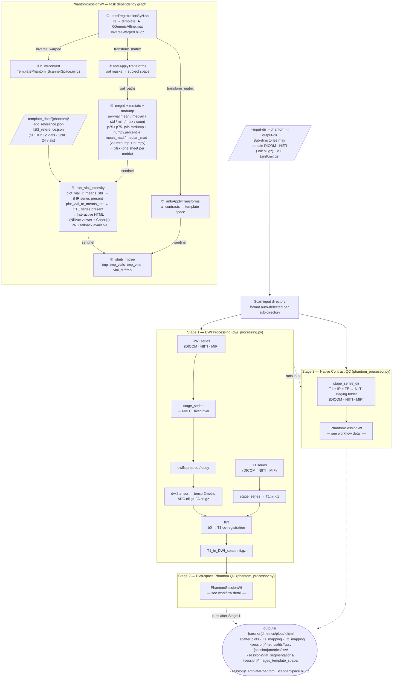

```mermaid
flowchart TD
    INPUT[/"--input-dir  --phantom  --output-dir<br/>Sub-directories may contain DICOM · NIfTI (.nii/.nii.gz) · MIF (.mif/.mif.gz)"/]

    INPUT --> SCAN["Scan input directory<br/>format auto-detected per sub-directory"]
    SCAN --> S1
    SCAN --> S3

    subgraph S1["Stage 1 — DWI Processing (dwi_processing.py)"]
        direction TB
        DWI_IN["DWI series<br/>(DICOM · NIfTI · MIF)"] --> STAGE1["stage_series<br/>→ NIfTI + bvec/bval"]
        T1_IN["T1 series<br/>(DICOM · NIfTI · MIF)"] --> STAGE1T1["stage_series → T1.nii.gz"]
        STAGE1 --> PREPROC[dwifslpreproc / eddy]
        PREPROC --> TENSOR["dwi2tensor → tensor2metric<br/>ADC.nii.gz  FA.nii.gz"]
        TENSOR --> FLIRT["flirt<br/>b0 → T1 co-registration"]
        STAGE1T1 --> FLIRT
        FLIRT --> T1DWI[T1_in_DWI_space.nii.gz]
    end

    subgraph S3["Stage 3 — Native Contrast QC (phantom_processor.py)"]
        direction TB
        STAGE3["stage_series_dir<br/>T1 + IR + TE → NIfTI staging folder<br/>(DICOM · NIfTI · MIF)"]
        STAGE3 --> WF3["PhantomSessionWf<br/>— see workflow detail —"]
    end

    T1DWI --> S2

    subgraph S2["Stage 2 — DWI-space Phantom QC (phantom_processor.py)"]
        direction TB
        WF2["PhantomSessionWf<br/>— see workflow detail —"]
    end

    subgraph WF["PhantomSessionWf — task dependency graph"]
        direction TB
        REG["①  antsRegistrationSyN.sh<br/>T1 → template  ►  0GenericAffine.mat<br/>InverseWarped.nii.gz"]

        REG -->|inverse_warped| SAVE["①b  mrconvert<br/>TemplatePhantom_ScannerSpace.nii.gz"]
        REG -->|transform_matrix| VIALS["②  antsApplyTransforms<br/>vial masks → subject space"]
        REG -->|transform_matrix| FWDXFM["⑤  antsApplyTransforms<br/>all contrasts → template space"]

        VIALS -->|vial_paths| METRICS["③  mrgrid + mrstats + mrdump<br/>per-vial mean / median / std / min / max / count<br/>p25 / p75  (via mrdump + numpy.percentile)<br/>mean_mad / median_mad  (via mrdump + numpy)<br/>→ xlsx (one sheet per metric)"]
        REFDATA[/"template_data/{phantom}/<br/>adc_reference.json<br/>t1t2_reference.json<br/>(SPIRIT: 12 vials · 120E: 24 vials)"/]
        REFDATA --> PLOTS
        METRICS -->|sentinel| PLOTS["④  plot_vial_intensity<br/>plot_vial_ir_means_std  ← if IR series present<br/>plot_vial_te_means_std  ← if TE series present<br/>→ Interactive HTML<br/>   (NiiVue viewer + Chart.js)<br/>   PNG fallback available"]

        PLOTS -->|sentinel| CLEANUP["⑥  shutil.rmtree<br/>tmp  tmp_vials  tmp_vols  vial_dir/tmp"]
        FWDXFM -->|sentinel| CLEANUP
    end

    S1 -.->|"runs in parallel"| S3
    S2 -.->|"runs after Stage 1"| DONE
    S3 -.-> DONE

    DONE(["outputs/<br/>  {session}/metrics/plots/*.html<br/>     scatter plots · T1_mapping · T2_mapping<br/>  {session}/metrics/fits/*.csv<br/>  {session}/metrics/csv/<br/>  {session}/vial_segmentations/<br/>  {session}/images_template_space/<br/>  {session}/TemplatePhantom_ScannerSpace.nii.gz"])
```
